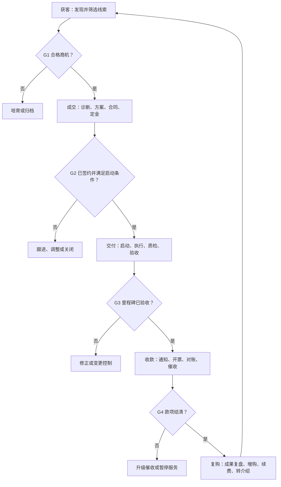

# OPC 收入链标准化 SOP

> 获客—成交—交付—收款—复购一体化操作手册

## 文档控制

| 项目 | 内容 |
|---|---|
| 文档名称 | OPC 收入链标准化 SOP |
| 文档编号 | OPC-REV-SOP-001 |
| 当前版本 | V1.0 |
| 适用对象 | 一人公司、个人工作室、AI OPC、产品化服务提供者 |
| 适用业务 | B2B 咨询、技术服务、AI 解决方案、定制开发、产品化服务；B2C 可按实际情况简化 |
| 流程负责人 | OPC 经营者 |
| 建议复审周期 | 每月检查、每季度修订，或发生重大异常后立即修订 |

---

## 1. 目的

本 SOP 用于将 OPC 的收入活动统一为一条可记录、可检查、可复用、可自动化的标准流程，重点解决以下问题：

- 获客依赖临时发挥，线索容易遗漏；
- 需求没有确认就报价或开工，导致范围失控；
- 交付过程缺少里程碑、验收和变更管理；
- 已完成工作却不能及时收款；
- 交付结束即失联，没有形成复购、案例和转介绍；
- AI 与自动化工具介入后，缺少必要的人工审核和风险边界。

本 SOP 的经营目标是：提高有效线索数、成交率、准时交付率、回款速度、客户终身价值，同时减少无效沟通、免费劳动和重复劳动。

## 2. 核心原则

1. **付费验证优先**：以定金、订单、合同或明确采购动作验证需求，不以点赞、口头认可代替商业验证。
2. **先确认再承诺**：需求、范围、交付物、验收标准、付款节点未确认，不进入正式交付。
3. **阶段门管理**：每一阶段必须满足退出条件，才能进入下一阶段。
4. **书面记录优先**：关键需求、报价、变更、验收和付款事项均须留存书面记录。
5. **现金流优先**：进度、验收、开票和收款必须联动，避免全部交付后才启动收款。
6. **交付即沉淀**：每个项目都要形成可复用的模板、组件、案例、Prompt、Agent Skill 或服务套餐。
7. **自动化不替代问责**：AI 可以整理、提醒、生成初稿和执行低风险动作；价格、合同、付款、退款、敏感数据和对外承诺必须由经营者确认。

## 3. 适用范围与非适用范围

### 3.1 适用范围

- 从线索发现到客户复购的完整收入链；
- 主动获客、内容获客、老客户推荐和合作伙伴转介；
- 咨询、开发、部署、培训、运维、订阅和产品化服务；
- 单人执行，或由 AI Agent、自由职业者、外包协作者辅助执行。

### 3.2 非适用范围

- 本 SOP 不替代当地法律、税务、财务和合同专业意见；
- 不授权 AI 自动签约、自动报价、自动付款、自动退款或作出法律承诺；
- 涉及医疗、金融、法律、关键基础设施等高风险领域时，应另建行业合规 SOP；
- 大型招投标、政府采购及复杂多方项目，应在本 SOP 基础上增加专项流程。

## 4. 收入链总流程



## 5. 阶段门定义

| 阶段门 | 必须满足的条件 | 不满足时的处理 |
|---|---|---|
| G0 线索入库 | 有明确联系人或可触达渠道；记录线索来源和潜在需求 | 信息不足则进入待研究清单，不进入销售预测 |
| G1 合格商机 | 客户与目标画像基本匹配；问题真实；有紧迫性或明确计划；可以接触决策链 | 进入培育、观察或归档，不投入大量方案时间 |
| G2 项目启动 | 需求范围、交付物、验收标准、价格、付款节点已确认；合同生效；首付款满足约定 | 不排正式工期，不投入大规模交付资源 |
| G3 里程碑验收 | 交付物完成内部质检；客户确认验收或形成书面异议清单 | 进入限次修正或变更流程 |
| G4 款项结清 | 应收金额到账并完成对账；相关凭证归档 | 按逾期等级提醒、协商、暂停服务或升级处理 |
| G5 复购闭环 | 完成成果复盘；明确续费、增购、案例、推荐或暂不跟进结论 | 设置下次跟进日期，禁止无期限悬空 |

---

# 第一阶段：获客 SOP

## 6. 目标

持续获得符合目标客户画像、问题明确、具备付费可能性的有效线索，并将线索推进到正式需求诊断，而不是单纯追求联系人数量或内容曝光量。

## 7. 触发条件

- 每日或每周例行情报与线索搜集；
- 内容收到咨询、评论、私信或表单提交；
- 老客户、朋友、合作伙伴转介绍；
- 发现招聘、采购、招标、融资、扩张、系统升级等需求信号；
- 过往客户进入计划复访日期。

## 8. 输入

- 理想客户画像 ICP；
- 标准服务清单、典型成果和价格区间；
- 行业情报、客户名单、内容互动记录；
- 老客户及合作伙伴关系记录；
- 线索登记表。

## 9. 操作步骤

### 9.1 定义目标客户画像

每季度至少确认一次：

- 行业、地区和组织规模；
- 目标岗位及决策角色；
- 高频、高成本、紧迫问题；
- 当前替代方案及不足；
- 可证明的交付能力和成功结果；
- 明确排除的客户类型。

### 9.2 选择获客渠道

每个周期最多集中经营 2～3 个主渠道：

| 渠道 | 标准动作 | 适用情况 |
|---|---|---|
| 主动外联 | 研究目标客户、个性化首触达、两至三次跟进 | 客单价较高、客户范围明确 |
| 内容获客 | 问题型选题、案例、方法、清单、明确行动入口 | 需要建立专业信任和长期流量 |
| 转介绍 | 交付后提出具体推荐请求，向合作伙伴回馈线索 | 已有客户或行业关系 |
| 社群与活动 | 回答问题、分享案例、参与专题交流 | 需要快速建立行业连接 |
| 平台与生态 | 上架服务、联合方案、插件或技术生态合作 | 服务可标准化、可被搜索和比较 |

### 9.3 线索入库

所有线索必须在发现当日或下一个工作日内登记，禁止只保留在聊天记录、浏览器收藏或个人记忆中。

最低字段：

- 线索编号；
- 客户名称、行业、规模；
- 联系人、角色、联系方式；
- 线索来源；
- 观察到的问题或触发事件；
- 潜在服务；
- 当前阶段；
- 下一行动及日期；
- 负责人；
- 最近沟通记录；
- 未成交或归档原因。

### 9.4 线索评分

每项按 0～2 分评分：

| 维度 | 0 分 | 1 分 | 2 分 |
|---|---|---|---|
| 客户匹配 | 明显不符合 ICP | 部分符合 | 高度符合 |
| 问题强度 | 没有明确问题 | 有问题但影响有限 | 高频、高损失或关键阻塞 |
| 紧迫性 | 无计划 | 未来可能处理 | 有明确时间窗口 |
| 付费能力 | 无预算迹象 | 预算不确定 | 有预算或采购能力 |
| 决策可达性 | 无法接触相关人员 | 可接触使用者或影响者 | 可接触决策人或明确决策链 |

建议判定：

- 8～10 分：优先推进；
- 5～7 分：继续验证或培育；
- 0～4 分：归档，除非出现新的强信号。

评分仅用于排序，不替代经营者判断。

### 9.5 首次触达

首次触达采用“观察—问题—价值—小行动”结构：

1. 说明为何联系对方；
2. 描述一个有依据的业务问题，不夸大；
3. 说明可提供的具体帮助或相关成果；
4. 请求一个低摩擦动作，如 15～30 分钟诊断、回复一个问题或查看简短材料。

不得批量发送虚假个性化信息，不得承诺未经验证的结果。

### 9.6 跟进与培育

- 每次沟通结束前约定下一行动；
- 连续跟进应提供新价值，如案例、诊断、数据或具体建议；
- 多次无回复后进入培育，不持续消耗高价值时间；
- 培育线索必须设置下一次触达日期或触发条件。

## 10. 获客阶段输出与完成标准

输出：线索卡、评分、沟通记录、下一行动。

满足以下条件，进入 G1：

- 初步确认客户问题与自身能力相关；
- 对方同意进一步诊断或提供需求资料；
- 存在时间、预算、组织动作或其他购买信号；
- 已识别至少一个使用者、影响者或决策相关人。

## 11. 获客指标

- 每周新增线索数；
- 有效线索数及有效率；
- 首次触达回复率；
- 诊断预约率；
- 各渠道有效线索成本；
- 从入库到首次有效沟通的时间；
- 无下一行动日期的线索数，应为 0。

---

# 第二阶段：成交 SOP

## 12. 目标

将合格商机转化为范围清晰、风险可控、付款条件明确的订单，并防止免费咨询、过度承诺和无边界试做。

## 13. 输入

- 合格线索卡及沟通记录；
- 客户背景资料；
- 需求诊断提纲；
- 服务套餐、报价模型和合同模板；
- 案例、能力证明和风险清单。

## 14. 操作步骤

### 14.1 需求诊断

至少确认以下问题：

1. 客户当前最需要解决的问题是什么？
2. 问题如何发生，发生频率是多少？
3. 当前方案是什么，为什么不满意？
4. 问题造成多少时间、成本、收入或风险损失？
5. 为什么需要现在解决？
6. 谁使用、谁影响、谁批准、谁付款？
7. 可使用的预算范围和采购方式是什么？
8. 希望何时看到什么结果？
9. 哪些数据、系统、接口、人员和权限可以提供？
10. 哪些条件可能导致项目失败？

需求记录必须区分：

- 客户确认事实；
- 经营者的合理推断；
- 尚待验证的假设；
- 明确不包含的事项。

### 14.2 机会判断

出现以下任一情况，应暂停、缩小或拒绝机会：

- 客户拒绝提供必要信息，却要求固定结果；
- 无法接触决策链，且没有明确推进路径；
- 要求大量免费定制或无偿 PoC；
- 预算与目标明显不匹配；
- 目标不可验证或验收完全主观；
- 要求违法、欺骗、绕过安全或不当使用数据；
- 交付依赖客户资源，但客户不愿承担配合责任；
- 对方存在严重付款风险或历史信用问题。

### 14.3 形成解决方案

方案应围绕业务结果组织，而不是简单罗列功能。至少包含：

- 现状与目标；
- 问题诊断；
- 解决路径；
- 交付物；
- 里程碑及工期；
- 验收标准；
- 客户配合事项；
- 已知假设、依赖和风险；
- 服务边界与排除项；
- 报价、付款和有效期。

可使用三档方案：

| 档位 | 目标 | 典型内容 |
|---|---|---|
| 验证版 | 用最低风险验证核心价值 | 诊断、小范围 PoC、单一场景 |
| 标准版 | 完成主要业务闭环 | 核心交付、培训、基础支持 |
| 增强版 | 获得更完整或持续的结果 | 集成、自动化、监控、持续优化或维护 |

### 14.4 定价检查

报价前至少核算：

- 预计直接工时；
- 沟通、测试、返工和管理时间；
- 软件、模型、算力、差旅、第三方和税费成本；
- 风险缓冲；
- 机会成本；
- 目标毛利；
- 客户可获得的价值。

不得仅按开发工时定价而忽略业务价值、支持成本和范围风险。

### 14.5 提案与异议处理

- 先再次确认问题和成功标准，再讲解决方案；
- 对价格异议优先调整范围、节奏或服务级别，不无条件降价；
- 所有新增承诺写入方案或合同；
- 每次提案结束后，记录决策、阻碍、责任人和下一日期；
- 方案超过有效期后重新确认资源、成本和排期。

### 14.6 合同与付款确认

合同或订单至少明确：

- 双方主体；
- 服务范围和排除项；
- 交付物、里程碑及验收标准；
- 双方责任；
- 价格、税费、开票及付款节点；
- 需求变更机制；
- 延期、暂停和终止规则；
- 保密、数据处理和知识产权；
- 售后范围；
- 争议处理方式。

建议将首付款或定金作为正式启动条件；具体比例根据业务类型、客户信用、交付周期及当地法律确定。

## 15. 成交阶段输出与完成标准

输出：需求确认单、正式方案、报价单、风险清单、合同或订单、付款记录、项目启动通知。

同时满足以下条件，进入 G2：

- 需求、范围、排除项和交付物已书面确认；
- 验收标准可操作、可验证；
- 合同或订单已生效；
- 首付款满足约定；
- 客户已指定对接人并确认配合事项；
- 项目具备启动所需的最低资料和权限。

## 16. 成交指标

- 合格商机到提案转化率；
- 提案到成交转化率；
- 平均客单价；
- 平均销售周期；
- 预收款比例；
- 未成交原因分布；
- 免费售前实际工时；
- 无明确下一行动的商机数，应为 0。

---

# 第三阶段：交付 SOP

## 17. 目标

在约定的时间、范围和质量条件下完成交付，通过过程透明、阶段验收和变更控制降低延期、返工与争议。

## 18. 输入

- 已生效合同或订单；
- 最终方案、交付物和验收标准；
- 客户联系人及决策链；
- 已到账首付款；
- 客户资料、账号、接口和权限；
- 项目模板、测试清单和风险清单。

## 19. 操作步骤

### 19.1 项目启动

启动前完成：

- 创建客户与项目档案；
- 建立项目目录和文档命名规则；
- 再次确认目标、范围、排除项和验收标准；
- 将交付物拆分为里程碑和任务；
- 确认双方联系人、沟通渠道和响应时限；
- 明确客户资料、权限和配合截止日期；
- 更新风险、依赖和假设；
- 发送启动纪要。

### 19.2 计划与任务拆解

每项任务至少包含：

- 任务名称；
- 所属交付物；
- 输入和依赖；
- 执行步骤；
- 完成定义；
- 计划与实际工时；
- 截止时间；
- 验证方法；
- 风险和回退措施。

优先按可演示、可验收的业务成果拆分，而不是只按技术模块拆分。

### 19.3 执行与沟通

- 按里程碑推进，避免项目末期一次性交付全部内容；
- 重要决定当日形成书面纪要；
- 至少每周发送一次简洁状态报告；
- 发现延期、成本超支或依赖失败时，在影响扩大前通知客户；
- 实际工时必须记录，用于评估利润和后续定价。

周报固定包含：

- 本周期完成事项；
- 可演示或可验证成果；
- 下周期计划；
- 客户待办；
- 风险、阻塞及影响；
- 需要客户作出的决定。

### 19.4 需求变更控制

出现新增需求、口径变化或前置条件变化时：

1. 暂停对新增事项的正式执行；
2. 记录变更内容和提出人；
3. 分析对范围、工期、费用、质量和风险的影响；
4. 判断属于原范围澄清、免费小调整或收费变更；
5. 形成变更单；
6. 经双方确认后更新计划和合同附件；
7. 未确认的变更不得默认执行。

建议提前定义免费修改次数和单次修改边界，避免无限返工。

### 19.5 内部质量检查

交付前依次检查：

1. **完整性**：合同范围内的交付物是否齐全；
2. **正确性**：功能、数据、逻辑和结论是否正确；
3. **可用性**：客户是否能够理解、操作和维护；
4. **安全性**：是否暴露密钥、个人信息、客户数据或高风险配置；
5. **一致性**：正式交付物是否与演示、方案和合同一致；
6. **可恢复性**：适用时是否具备备份、回滚或替代方案。

AI 生成内容还必须检查事实、来源、幻觉、版权、隐私和未经授权的承诺。

### 19.6 阶段演示与验收

- 依据验收标准逐项演示，不以“已开发完成”代替客户可验证结果；
- 记录客户确认、异议和限期整改项；
- 将合同范围外意见单独列为后续建议或变更；
- 达到标准后，请客户在约定期限内书面确认；
- 客户未及时反馈时，按合同约定和书面提醒处理，不自行假设验收完成。

### 19.7 交付归档

项目阶段或最终验收后归档：

- 最终交付物；
- 测试与验收记录；
- 需求与变更记录；
- 关键沟通纪要；
- 使用和维护说明；
- 账号、权限移交或回收记录；
- 实际工时与成本；
- 可复用资产；
- 已知问题及售后边界。

## 20. 交付异常处理

| 异常 | 处理规则 |
|---|---|
| 客户资料或权限延期 | 书面提醒；评估对排期的影响；必要时顺延里程碑 |
| 需求持续变化 | 启动变更控制，不默认免费吸收 |
| 发现无法实现的技术条件 | 立即报告事实、影响、替代方案和成本，不隐瞒到交付末期 |
| 客户长期不反馈 | 按约定频次提醒；标记等待客户；必要时暂停项目 |
| 质量问题 | 先控制影响，再修复、验证、沟通并复盘 |
| 重大故障或数据事件 | 启动专项事件响应；保留时间线和证据；禁止未经核验地对外解释根因 |
| 实际成本严重超出 | 分析是估算错误、范围变化还是效率问题；决定变更、止损或内部吸收 |

## 21. 交付阶段输出与完成标准

输出：启动纪要、项目计划、周报、变更记录、交付物、测试报告、验收记录、使用说明、归档包。

进入 G3 的条件：

- 本阶段约定交付物齐全；
- 完成内部质量检查；
- 客户已确认验收，或已按合同约定形成正式验收结论；
- 未完成事项、已知限制和售后责任已明确；
- 对应收款材料已准备完成。

## 22. 交付指标

- 里程碑准时率；
- 一次验收通过率；
- 计划与实际工时偏差；
- 项目毛利率；
- 需求变更次数及金额；
- 返工工时占比；
- 客户等待时间与自身处理时间；
- 每项目沉淀的可复用资产数。

---

# 第四阶段：收款 SOP

## 23. 目标

使验收、开票、付款和对账同步推进，缩短应收周期，减少逾期和坏账，保障 OPC 的现金流安全。

## 24. 输入

- 合同、订单及付款节点；
- 里程碑与验收记录；
- 开票资料；
- 应收账款台账；
- 客户财务联系人和付款流程；
- 银行或支付平台到账记录。

## 25. 操作步骤

### 25.1 成交时建立应收计划

签约后立即记录：

- 合同总额；
- 各付款节点金额和触发条件；
- 预计开票和到期日期；
- 客户业务、采购和财务联系人；
- 开票要求和付款资料；
- 客户内部付款周期；
- 逾期处理约定。

### 25.2 付款节点触发

达到付款条件后，在一个工作日内：

1. 整理验收或里程碑证明；
2. 发送付款通知；
3. 按约定开票或提交付款资料；
4. 确认客户已收到且资料完整；
5. 更新应收状态和预计付款日。

### 25.3 到期提醒

以下为建议节奏，应根据客户流程、合同和当地法律调整：

| 时间 | 建议动作 |
|---|---|
| 到期前 3～5 个工作日 | 友好确认资料是否完整、付款是否已排期 |
| 到期日 | 发送简洁提醒并确认预计到账日 |
| 逾期 3 天 | 联系业务与财务对接人，查明具体阻塞 |
| 逾期 7 天 | 书面提醒合同约定，要求明确付款计划 |
| 逾期 15 天 | 升级至决策人；评估暂停新增交付或支持 |
| 逾期 30 天及以上 | 根据金额、证据、客户情况和合同启动协商、正式催收或专业处理 |

每次催收必须记录时间、对象、回应、承诺日期和下一行动。沟通保持事实化，不使用威胁、骚扰或不符合法律规定的方式。

### 25.4 到账与对账

- 核对客户、金额、币种、订单及付款节点；
- 更新应收状态；
- 保存到账凭证；
- 向客户确认收款；
- 如有差额，立即查明税费、手续费、扣款或付款错误；
- 全部结清后进入 G4。

### 25.5 现金流预警

每周检查：

- 未来 4～12 周预计回款；
- 逾期应收及账龄；
- 单一客户应收集中度；
- 固定支出和可用现金；
- 已签约但未满足收款条件的金额；
- 预计收入与已到账现金的差异。

不得将“已报价”或“口头确定”计作现金收入。

## 26. 收款阶段输出与完成标准

输出：付款通知、发票或付款资料、催收记录、到账凭证、对账记录、更新后的应收台账。

进入 G4 的条件：

- 本付款节点或项目全部应收到账；
- 金额及订单核对无误；
- 收款凭证和相关资料已归档；
- 如有未结事项，已形成双方确认的书面计划。

## 27. 收款指标

- 到期回款率；
- 平均回款周期；
- 逾期金额及账龄结构；
- 应收账款总额；
- 预收款占合同额比例；
- 付款提醒后承诺兑现率；
- 单一客户应收集中度；
- 坏账或减免金额。

---

# 第五阶段：复购 SOP

## 28. 目标

将一次性交付转化为可持续客户价值，通过成果复盘、维护、增购、续费、案例和转介绍提高客户终身价值，降低新增客户获客成本。

## 29. 输入

- 客户目标、交付物及验收结果；
- 使用数据和实际业务结果；
- 售后问题及解决记录；
- 客户反馈；
- 可提供的下一阶段服务；
- 案例和转介绍授权模板。

## 30. 操作步骤

### 30.1 交付后跟进节奏

| 时间 | 主要动作 |
|---|---|
| 验收后 1～7 天 | 确认交付物可用、资料完整、使用无阻塞 |
| 约 30 天 | 复盘初步结果、使用情况、新问题和优化机会 |
| 约 60～90 天 | 评估长期成果、续费、增购、案例与转介绍 |
| 此后按月或季度 | 根据服务类型进行客户健康检查和价值回顾 |

时间为建议值，应根据产品采用周期和合同安排调整。

### 30.2 成果复盘

围绕客户签约前的目标检查：

- 哪些指标已经改善；
- 改善来自哪些交付内容；
- 哪些目标未实现及原因；
- 当前存在的新瓶颈；
- 客户团队是否真正使用；
- 是否需要培训、维护、优化或扩展。

不得将无法归因的业务变化全部归功于本服务。

### 30.3 客户健康判断

每项按 0～2 分记录：

- 使用活跃度；
- 目标达成程度；
- 客户满意度；
- 关系稳定度；
- 付款情况；
- 新需求强度。

低分客户优先解决采用和价值问题，不宜立即强推增购。

### 30.4 复购与增购提案

复购建议必须基于已发现的下一问题，说明：

- 当前结果；
- 尚未解决的损失或机会；
- 下一阶段目标；
- 建议方案和价值；
- 与原项目的关系；
- 所需投入、周期和付款安排。

典型复购形式：

- 持续顾问；
- 运维与支持；
- 功能扩展或系统集成；
- 培训和团队赋能；
- 定期数据分析或情报服务；
- 订阅、授权或用量套餐；
- 从定制项目升级为产品化服务。

### 30.5 案例沉淀

获得客户授权后，案例包含：

- 客户背景；
- 原始问题；
- 约束条件；
- 解决路径；
- 可验证结果；
- 客户评价；
- 适用边界。

未经授权，不公开客户名称、数据、系统细节、截图或敏感信息。无法公开实名时，可制作经脱敏的匿名案例。

### 30.6 转介绍

在客户已经确认获得价值后提出具体请求：

- 描述希望认识的客户类型；
- 说明可解决的问题；
- 提供一段便于转发的简短介绍；
- 尊重客户是否愿意推荐；
- 记录推荐来源并及时反馈进展；
- 如有推荐激励，事先书面说明且符合相关规则。

### 30.7 进入下一轮收入链

- 增购或续费：建立新商机，复用已有资料但重新确认范围；
- 转介绍：作为新线索进入获客阶段；
- 暂无需求：设置下一次复访日期；
- 明确流失：记录原因并停止无效跟进。

## 31. 复购阶段输出与完成标准

输出：成果复盘、客户健康记录、下一阶段建议、续费或增购商机、案例授权、转介绍记录、下次跟进日期。

完成 G5 的条件：

- 已确认客户当前使用和成果；
- 已给出适当的下一步，而非无依据推销；
- 复购、转介绍、培育或关闭状态明确；
- 每个仍在经营的客户都有下一行动及日期。

## 32. 复购指标

- 客户复购率；
- 续费率；
- 增购收入；
- 客户终身价值；
- 老客户收入占比；
- 转介绍线索数及成交率；
- 案例授权率；
- 交付后 30/90 天跟进完成率；
- 客户流失原因分布。

---

# 跨阶段管理机制

## 33. 统一状态定义

建议在 CRM、表格或知识库中统一使用以下状态：

| 阶段 | 状态 |
|---|---|
| 获客 | 待研究、新线索、已联系、已回应、培育、归档 |
| 成交 | 待诊断、已诊断、合格商机、方案准备、已提案、谈判、成交、丢单 |
| 交付 | 待启动、执行中、等待客户、风险、待验收、已验收、已关闭 |
| 收款 | 未触发、待开票、待付款、部分到账、逾期、已结清、争议 |
| 复购 | 待回访、健康、需干预、增购机会、续费中、推荐、流失 |

每个活动对象必须具备“当前状态、下一行动、责任人、截止日期”四个字段。

## 34. 最小经营数据表

至少维护四张表：

1. **线索与商机表**：客户、来源、评分、阶段、预计金额、下一行动；
2. **项目交付表**：里程碑、任务、计划/实际工时、风险、验收；
3. **合同与应收表**：合同额、付款节点、到期日、到账、逾期；
4. **客户成功表**：目标、使用、成果、健康度、续费、增购、推荐。

若工具能力允许，应使用唯一的客户编号、商机编号、项目编号和合同编号关联，避免重复维护不一致的数据。

## 35. 核心指标仪表盘

### 35.1 每周指标

- 新增有效线索；
- 首次有效沟通数；
- 需求诊断数；
- 新增合格商机金额；
- 发出方案数；
- 新成交金额；
- 本周到账金额；
- 下周应收金额；
- 交付风险项目数；
- 下一周最重要的收入行动。

### 35.2 每月指标

| 指标 | 计算方式 |
|---|---|
| 线索有效率 | 合格线索数 ÷ 新增线索数 |
| 成交率 | 成交商机数 ÷ 已形成明确决策的合格商机数 |
| 平均客单价 | 成交合同总额 ÷ 成交客户数 |
| 项目毛利率 | （项目收入－直接交付成本）÷ 项目收入 |
| 准时交付率 | 准时完成里程碑数 ÷ 到期里程碑数 |
| 到期回款率 | 到期已收金额 ÷ 到期应收金额 |
| 复购率 | 发生复购客户数 ÷ 具备复购观察条件的客户数 |
| 老客户收入占比 | 老客户收入 ÷ 总收入 |
| 有效时薪 | 收入或毛利 ÷ 全部实际投入工时，口径应固定 |
| 资产复用率 | 使用既有模板或组件的交付内容 ÷ 可复用交付内容 |

不得为了数据好看频繁改变指标口径。口径变化必须记录生效日期。

## 36. 经营复盘机制

### 36.1 每日 10 分钟

- 更新线索、商机、项目和应收状态；
- 确认明日最重要的收入动作；
- 清理无下一行动的事项。

### 36.2 每周 30～45 分钟

- 检查管道、交付、应收和复购指标；
- 找出一个最大瓶颈；
- 选择三项下周关键行动；
- 决定一项停止、删除、模板化或自动化的工作。

### 36.3 每月 60～90 分钟

- 比较目标与实际收入、毛利和现金流；
- 分析渠道、服务、客户类型和项目利润；
- 汇总丢单、返工、延期、逾期和流失原因；
- 修订报价、服务范围、目标客户画像和 SOP；
- 决定下月要强化或停止的服务。

## 37. AI 与自动化边界

| 活动 | 可自动执行 | 必须人工确认 |
|---|---|---|
| 线索研究 | 公开信息汇总、去重、初步评分、提醒 | 敏感信息收集、最终资格判断 |
| 客户沟通 | 草拟邮件、整理纪要、生成跟进提醒 | 实际发送高影响消息、结果承诺 |
| 方案报价 | 生成初稿、成本测算、引用已有模板 | 最终范围、价格、折扣和交期 |
| 合同 | 条款检查清单、版本比较、风险提示 | 签署、法律判断、接受风险 |
| 项目交付 | 任务拆解、代码或内容初稿、测试辅助、周报 | 最终质量、生产变更、高风险操作 |
| 收款 | 到期提醒、台账更新、对账辅助 | 开票确认、退款、减免、正式催收升级 |
| 复购 | 成果摘要、健康度初评、跟进提醒 | 增购承诺、公开案例、转介绍沟通 |
| 数据安全 | 密钥扫描、权限检查、备份提醒 | 删除数据、共享客户资料、权限授予 |

任何自动化上线前必须明确：输入、输出、权限、费用上限、人工审核点、失败通知、日志、回退方式和数据保留规则。

## 38. 安全与资料管理

- 客户资料按客户和项目隔离；
- 密钥不得直接写入交付文档、代码仓库或提示词；
- 重要账号启用多因素认证；
- 遵循最小权限，项目结束后回收不再需要的权限；
- 重要经营数据和交付物定期备份，并测试恢复；
- 对外共享前检查个人信息、客户机密、授权和知识产权；
- AI 工具处理客户资料前，确认使用边界和数据政策；
- 重大事件结束后记录时间线、影响、根因、处置和改进动作，并据此更新 SOP。

## 39. SOP 修订触发条件

发生以下任一情况，应更新本 SOP 或相关模板：

- 同类问题发生两次以上；
- 出现严重丢单、延期、返工、逾期或客户流失；
- 服务模式、价格、客户类型或工具发生明显变化；
- 新增外部协作者或 Agent；
- 法律、税务、平台政策或客户合规要求发生变化；
- 复盘发现某步骤无价值、重复或可自动化。

---

# 标准模板

## 模板 A：线索卡

```markdown
# 线索卡

- 线索编号：
- 客户/联系人：
- 行业/规模/角色：
- 来源：
- 触发事件：
- 观察到的问题：
- 可能需要的服务：
- 客户匹配：0/1/2
- 问题强度：0/1/2
- 紧迫性：0/1/2
- 付费能力：0/1/2
- 决策可达性：0/1/2
- 总分：
- 当前状态：
- 下一行动：
- 截止日期：
- 沟通记录：
- 归档/丢单原因：
```

## 模板 B：需求确认单

```markdown
# 需求确认单

## 客户目标

## 当前问题与影响

## 当前解决方式

## 成功指标

## 用户、影响者、决策人和付款人

## 预算、采购和时间要求

## 可提供的数据、系统、接口、人员及权限

## 客户确认的事实

## 尚待验证的假设

## 关键风险与依赖

## 本次明确不包含的事项

## 下一行动、责任人和日期
```

## 模板 C：方案与报价摘要

```markdown
# 方案与报价摘要

- 项目目标：
- 解决路径：
- 交付物：
- 里程碑：
- 验收标准：
- 客户配合事项：
- 排除项：
- 假设与依赖：
- 已知风险：
- 价格及税费：
- 付款节点：
- 方案有效期：
- 售后范围：
- 下一步：
```

## 模板 D：项目启动清单

```markdown
# 项目启动清单

- [ ] 合同或订单已生效
- [ ] 首付款满足约定
- [ ] 范围与排除项已确认
- [ ] 交付物与验收标准已确认
- [ ] 里程碑与计划已建立
- [ ] 客户对接人和决策人已明确
- [ ] 资料、账号、接口和权限已检查
- [ ] 沟通渠道与响应时限已确认
- [ ] 客户配合事项及截止日期已确认
- [ ] 风险、依赖和假设已登记
- [ ] 项目目录和版本规则已建立
- [ ] 启动纪要已发送
```

## 模板 E：项目周报

```markdown
# 项目周报

- 报告周期：
- 总体状态：正常 / 有风险 / 阻塞

## 已完成

## 可验证成果

## 下周期计划

## 客户待办

## 风险与阻塞

## 需要客户决定的事项

## 范围或费用变化

## 下一里程碑及日期
```

## 模板 F：需求变更单

```markdown
# 需求变更单

- 变更编号：
- 提出人及日期：
- 原需求/范围：
- 变更内容：
- 变更原因：
- 对交付物的影响：
- 对工期的影响：
- 对费用的影响：
- 对质量和风险的影响：
- 建议处理方式：
- 双方确认：
- 生效日期：
```

## 模板 G：验收记录

```markdown
# 验收记录

- 项目/里程碑：
- 交付日期：
- 交付物清单：
- 验收标准及逐项结果：
- 测试或演示记录：
- 已知限制：
- 整改事项、责任人和日期：
- 范围外建议：
- 验收结论：通过 / 有条件通过 / 不通过
- 双方确认：
```

## 模板 H：应收与催收记录

```markdown
# 应收与催收记录

- 客户/合同：
- 付款节点：
- 应收金额：
- 触发条件及完成证据：
- 开票日期：
- 到期日期：
- 当前状态：
- 历次提醒时间、对象及反馈：
- 客户承诺付款日期：
- 下一行动及日期：
- 到账日期与金额：
- 差异说明：
```

## 模板 I：交付后成果复盘

```markdown
# 交付后成果复盘

- 客户原始目标：
- 已交付内容：
- 已实现成果及证据：
- 未实现目标及原因：
- 当前使用和采用情况：
- 新出现的问题或机会：
- 客户反馈：
- 建议的下一阶段：
- 复购/续费状态：
- 案例授权状态：
- 转介绍状态：
- 下一行动及日期：
```

## 模板 J：丢单或异常复盘

```markdown
# 丢单或异常复盘

- 事件：
- 时间线：
- 影响：
- 直接原因：
- 深层原因：
- 哪些信号本可提前发现：
- 哪条 SOP 未执行或不完善：
- 临时处置：
- 永久改进动作：
- 责任人和完成日期：
- 需要更新的模板、自动化或指标：
```

---

# 40. 四周落地计划

## 第 1 周：先跑通获客与成交

- 定义一个主要 ICP；
- 建立线索与商机表；
- 启用线索卡、需求确认单和报价摘要；
- 清理现有联系人并登记下一行动；
- 选择两个主要获客渠道。

## 第 2 周：规范交付

- 建立项目启动清单、周报、变更单和验收记录；
- 选择一个在手项目按本 SOP 运行；
- 开始记录实际工时和返工原因。

## 第 3 周：控制应收与复购

- 建立合同与应收表；
- 补录全部付款节点和到期日；
- 对已交付客户执行一次成果回访；
- 识别续费、增购、案例和转介绍机会。

## 第 4 周：复盘与自动化

- 计算第一轮转化、交付和回款指标；
- 找出收入链的最大瓶颈；
- 仅自动化一个高频、规则清晰、低风险环节；
- 修订不符合实际的字段和步骤；
- 冻结 V1.1 并进入月度复盘节奏。

## 41. 最终执行检查表

每周结束前确认：

- [ ] 所有线索和客户均已入库；
- [ ] 所有活动商机均有下一行动和日期；
- [ ] 未签约或未满足启动条件的项目没有擅自正式开工；
- [ ] 所有在手项目状态、风险和客户待办已更新；
- [ ] 所有范围变化均已记录和确认；
- [ ] 达到付款条件的项目已在一个工作日内启动收款；
- [ ] 所有逾期款项均有明确责任人和下一动作；
- [ ] 所有已交付客户均有回访或复购计划；
- [ ] 本周至少沉淀一项可复用资产；
- [ ] 已识别下周最重要的收入行动。

---

## 参考依据

- HubSpot，销售管道阶段及阶段化管理：<https://blog.hubspot.com/sales/sales-pipeline-stages-visual-guide>
- Stripe，应收催款与逾期沟通：<https://stripe.com/resources/more/dunning-management-101-why-it-matters-and-key-tactics-for-businesses>
- NIST，小企业网络安全基础，包括 MFA、密码与备份恢复：<https://www.nist.gov/itl/smallbusinesscyber/cybersecurity-basics>
- Atlassian，事故复盘过程和持续改进：<https://www.atlassian.com/incident-management/postmortem/templates>

> 说明：文档中的评分、时间和提醒节奏是面向 OPC 的推荐默认值，不是强制标准。应根据业务类型、合同、客户采购流程及所在地区法律调整。
